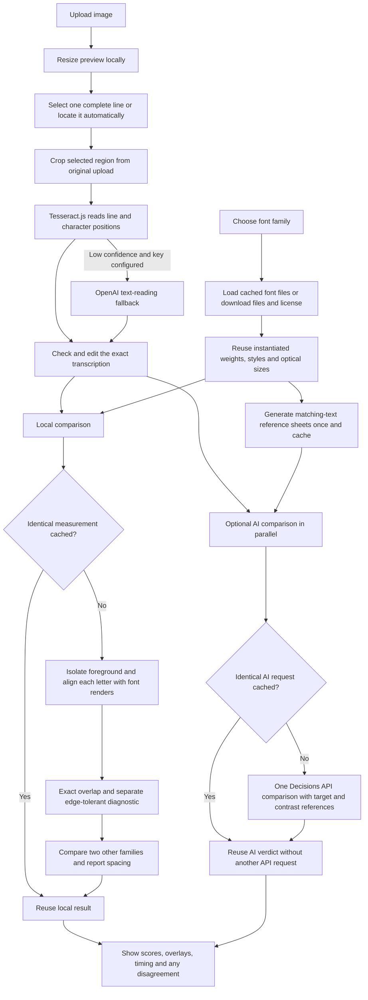
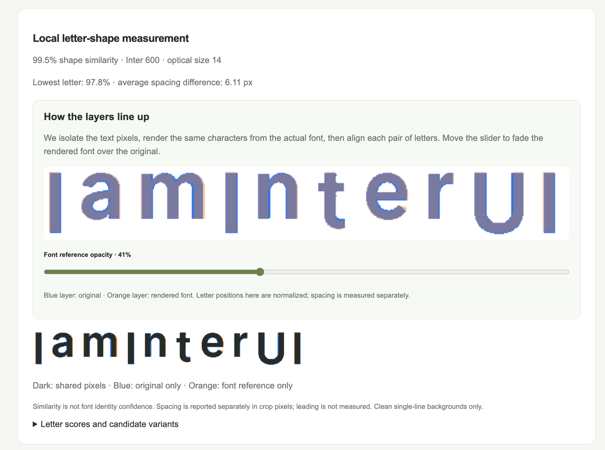
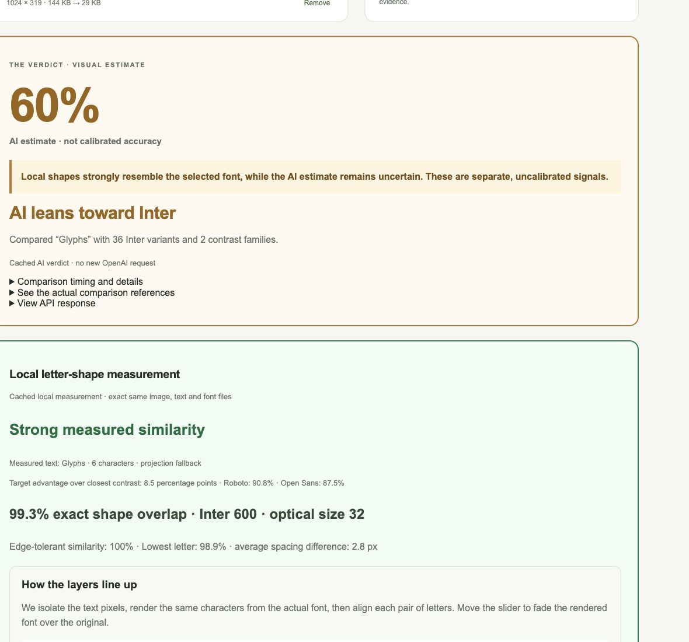

# Fonts Checker

An experimental web tool for checking whether text in an image resembles a selected font. It renders comparison material from the actual font files, measures individual letter shapes, and optionally asks OpenAI for a separate visual estimate.

**It checks letterforms, not whether the font’s name appears in the image.** A printed word such as “Inter” supplies shapes to compare; the word itself is never proof of font identity. No model is trained or fine-tuned by this app.


*Your supplied screenshot shows an earlier prototype. The current result cards and caching feedback are illustrated below.*

## Use it

1. Choose a font family and upload a PNG, JPEG, or WebP (up to 20 MB).
2. Drag a box around **one complete physical line**, including its ascenders, descenders, and punctuation. The crosshair cursor indicates selection. Alternatively, Analyze can locate a prominent line automatically.
3. Check **Text for comparison**. OCR can confidently misread a letter, omit a character, or select a different line. Correct the text to match the box exactly.
4. Analyze. The verdict starts as a compact spinner. Local measurements and the optional AI estimate run concurrently and appear independently as they finish.
5. Inspect the references, letter overlays, competing fonts, and individual scores before interpreting a high percentage.

Images cannot be dragged out of the preview. Drawing a new selection clears the previous transcription and results. Manual transcriptions are preserved during analysis, even when measurement fails.

## How it works



### Actual fonts supply the references

Inter uses bundled **official Inter 4.1** files from [Rasmus Andersson](https://rsms.me/inter/). Other supported families are downloaded from the [Google Fonts repository](https://github.com/google/fonts), with their license, source information, and file hashes. Proprietary fonts and arbitrary font URLs are not downloaded.

FontTools reads each font’s glyphs and variation axes. Pillow renders available standard weights, upright and italic files, and sampled optical sizes. Inter has **36 variants**: nine weights from 100 to 900, two styles, and optical sizes 14 and 32. Generic diagnostic sheets use 18, 32, and 52 px text. Other variable axes stay at their defaults; every possible axis value or OpenType feature combination is not enumerated.

Matching-text sheets preserve all available weight and style samples. Apparent weight estimates never exclude heavy, thin, or italic candidates. Confident size estimates can select 18/32 or 32/52 px references. Short transcriptions use compact 52 px sheets, with two columns when the complete text fits; wide strings fall back to full-width rows. Long transcriptions use readable prefixes instead of shrinking all glyphs. Transmission is capped at six target sheets plus two contrast sheets, so very large families can have sampled page coverage.

Inter, Roboto, and Open Sans include committed font files, licenses, and generic reference packs. A fresh checkout can use these without downloading or regenerating the generic sheets. These packs are reference material, not a training dataset.

### OCR and selection

**Tesseract.js runs in the Node web backend using WebAssembly.** It needs neither an OpenAI key nor macOS. Sparse-text detection locates prominent lines in a full image; a manually selected line uses single-line OCR. English language data downloads once and is cached. Font rendering supports Unicode glyphs supplied by the font, but OCR language coverage is currently English.

A bright, neutral-letter mask can help recover white text on a colorful background by removing small isolated highlights. This is a limited preprocessing fallback, not general background removal. Local OCR is accepted automatically at 75% OCR confidence. This measures transcription confidence, not font confidence. Low-confidence reading can fall back to OpenAI Responses when a key is configured; otherwise the user must enter the text.

After locating the line, the browser crops from the **original uploaded file**, up to 1,600 px on the crop’s longest edge. This preserves more letter detail than cropping an already downscaled full-page preview. Crops use lossless PNG when they fit the request limit, with high-quality JPEG as a size fallback. Automatic boxes add a small margin; manual selections use exactly the drawn box.

### Local letter-shape measurement



*Layer visualization from the supplied screenshot. Current ranking uses exact overlap; the earlier score shown here used edge tolerance.*

The local comparison isolates foreground ink, tries clean-line pixel segmentation first, and falls back to OCR character positions with ink refinement. It requires one line up to 120 characters with at least three letters or digits. Punctuation and font-supported Unicode are allowed. Ink height must be at least 16 px.

The renderer creates the same characters from every available font variant. It scales the reference using a shared line-height scale, preserves letter proportions, and translates each letter independently by up to one pixel to find its best alignment. It does not stretch each glyph to make it fit.

**Exact shape overlap** is the mean binary Dice overlap of aligned letter pairs. One-pixel edge-tolerant similarity is reported separately as a diagnostic; it no longer ranks candidates or determines the green status. The previous forgiving score could hide outline differences in Arial and Helvetica samples.

The blue layer is original ink, the orange layer is rendered reference ink, and dark pixels in the difference view are shared. The opacity slider lets you fade between layers. Positions in this view are normalized for shape comparison. Average spacing difference is measured separately in crop pixels; leading is not measured.

Two other families, chosen from Inter, Roboto, and Open Sans, are measured using the same transcription and segmentation path. **Strong measured similarity** currently requires at least 90% exact overlap and a lead of at least three percentage points over both contrasts. Missing contrasts produce an incomplete comparison. Very low overlap is labeled unreliable. These thresholds are provisional; shape overlap is not the probability that the font is correct.

### Optional visual estimate

With an OpenAI key, the Decisions API receives the selected image, literal transcription, actual target-font references, and contrast references. It returns separate estimates for font match and readable-text sufficiency. OCR instructions and printed labels are not identity evidence.

The large AI percentage is shown in green at 80% or higher, red at 20% or lower, and orange between them or when text is insufficient. Intermediate results say “AI leans toward” or “inconclusive.” These are display conventions, not calibrated certainty boundaries. The app never changes the returned probability to match the local score.



The example above shows why the results stay separate: 99.3% exact shape overlap and a 60% AI estimate do not represent the same measurement. The UI explicitly explains disagreements or unavailable local evidence. A refusal, failed request, or unreliable local segmentation does not establish a font mismatch. The normal UI makes **one Decisions request**, with no automatic retry. The backend accepts an explicit `retryBroad: true` request for the existing broader-reference retry.

## Caching and speed

| Material | Cache and reuse |
| --- | --- |
| Font files and licenses | Disk under `.cache/fonts`; bundled packs seed the cache |
| Instantiated variable-font variants | Disk, keyed by font bytes and axis coordinates; shared by reference rendering and measurement |
| Generic references | Committed packs for Inter, Roboto, Open Sans; disk cache for other families |
| Matching-text references | Disk, keyed by transcription, selection, font bytes, and renderer code |
| Local OCR positions | Process memory, at most 12 input images/options, including concurrent request reuse |
| Local measurements | Exact inputs, font files, and measurement code; process memory, 12 entries, 10-minute lifetime, 12 MB limit |
| AI verdicts | Exact outgoing payload, including image, text, references, model, and prompt; same process-memory bounds |

Concurrent identical comparisons share pending work. Failed AI requests and refusals are not retained. Result caches clear on restart and do not persist uploaded images or verdicts. Matching-text render caches contain the transcription and generated specimens on disk; `.cache` is ignored by Git and should not be published.

Target and contrast font preparation runs concurrently. The two local contrast measurements run concurrently. The visual comparison does not wait for local measurement to finish. The compact verdict keeps reference and API details expandable so local evidence is easier to see alongside it. Stage timing distinguishes reference preparation from the OpenAI wait; cache hits explicitly say no new OpenAI request was made.

Observed on this development machine:

- Rendering a new transcription across 36 Inter variants dropped from **36.1 seconds to 0.37 seconds**, with font instances already cached. First-time font preparation can still take longer. Concurrent cold instance builds share a lock on Unix backend hosts.
- One live AI comparison took **1.5 seconds**; its identical cached repeat took **3 ms**. A repeated local measurement also took **3 ms**. The higher-resolution Glyphs check took 6.4 seconds locally, then 4 ms on repeat; preserving detail can increase first-pass measurement time. These are backend observations, not latency guarantees or averages.
- Compact references reduced one short-word request from **13,073 to 7,520 input tokens** while retaining all 36 target variants. Reduced tokens do not prove better identification quality.

See [performance review](eval/performance-review.json). OpenAI network and model latency remain outside the local cache’s control; the [official latency guide](https://developers.openai.com/api/docs/guides/latency-optimization) describes parallel requests and reducing duplicate work.

## Evaluation and limitations

The [local benchmark](eval/local-benchmark.json) contains 36 synthetic Inter variants and eight negatives (Arial, Helvetica, Verdana, Times New Roman). On the current run, 42 of 44 cases were measurable, nine Inter cases reached the provisional strong status, and none of the eight negatives reached it. The earlier run produced one strong Inter result. Two thin italic cases still could not be measured. This small fixture set is not a calibrated accuracy study.

The [audit of nine supplied images](eval/real-images-audit.json) records uncorrected OCR, hashes, and local measurements without OpenAI calls. Three reached strong similarity; two could not be checked. It also exposes confidently wrong OCR such as “hice” and “Januar.” The supplied Inter labels are user observations, not independently verified metadata.

Short words, ligatures, touching italic letters, older font versions, OpenType alternates, low resolution, distorted text, and textured backgrounds remain difficult. A high overlap can occur for lookalikes; a low score can be caused by bad transcription or segmentation. Confirm the selected line, inspect the layers, and compare more distinctive letters. The tool does not verify embedded font metadata, licensing, or every font on a page.

A proper font-identity accuracy claim still needs a larger independently labeled evaluation, more close competitors, OCR error accounting, and threshold calibration. Neither AI percentages nor overlap percentages should be presented as a measured success rate.

## Run locally or host on the web

Requires **Node.js 22+**, **Python 3.10+**, and the renderer dependencies. This is a web app with a Node/Python backend, not static-only hosting. First-time language-data downloads and uncached fonts need internet access. No native macOS component is required.

```sh
npm ci
npm run setup:fonts
npm start
```

Open [localhost:3000](http://localhost:3000/). Local OCR and letter measurement work without an API key. For the separate visual estimate and fallback text reading, copy `.env.example` to `.env`, add `OPENAI_API_KEY`, and restart the server. The current models are `gpt-6-luna` for Decisions and `gpt-4.1-mini` for fallback text reading. Keep the key on the server; never put it in browser code or commit `.env`.

Set `HOST` and `PORT` for the backend host. Persistent writable `.cache` storage improves warm performance. Deployments must support both runtimes and outbound font, language-data, and optional OpenAI requests.

```sh
npm test
.renderer/bin/python scripts/test-measurement.py
npm run benchmark:local
node scripts/audit-real-images.mjs /path/to/supplied-images
npm run prebuild:fonts -- Inter Roboto "Open Sans"
```

Prebuilding exports **generic diagnostic text only**, with fonts and licenses. It never exports cached user transcriptions. Add selected generic packs to Git when distributing them; generated caches and uploads remain outside the repository.

## Main files

- `public/app.js`, `public/evidence.js`, `public/style.css`: selection, asynchronous results, evidence feedback, overlays, and loading UI.
- `server.mjs`: web endpoints, local OCR, and optional OpenAI text-reading fallback.
- `analyze.mjs`, `decision.mjs`: reference-backed Decisions request, timing, and exact-result caching.
- `font-library.mjs`, `scripts/render-font.py`, `scripts/font-instances.py`: download, instantiate, render, and reuse actual fonts.
- `measurement.mjs`, `scripts/measure-font.py`: local letter alignment, exact overlap, contrast measurement, and spacing.
- `ocr-positions.mjs`, `ocr-selection.mjs`, `scripts/ocr-mask.py`: Tesseract positions, line selection, and bright-letter preprocessing.
- `result-cache.mjs`: bounded per-process cache with in-flight deduplication.
- `references/packs`, `eval`: reusable generic font packs and recorded evaluation results.
