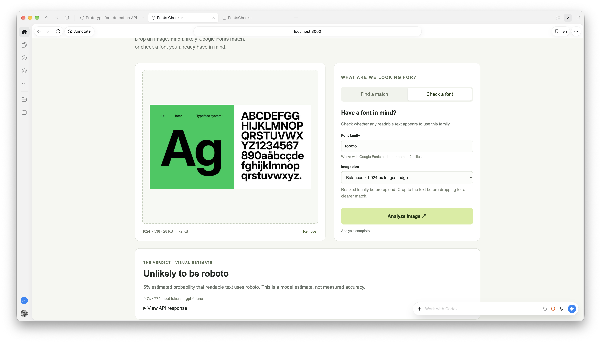
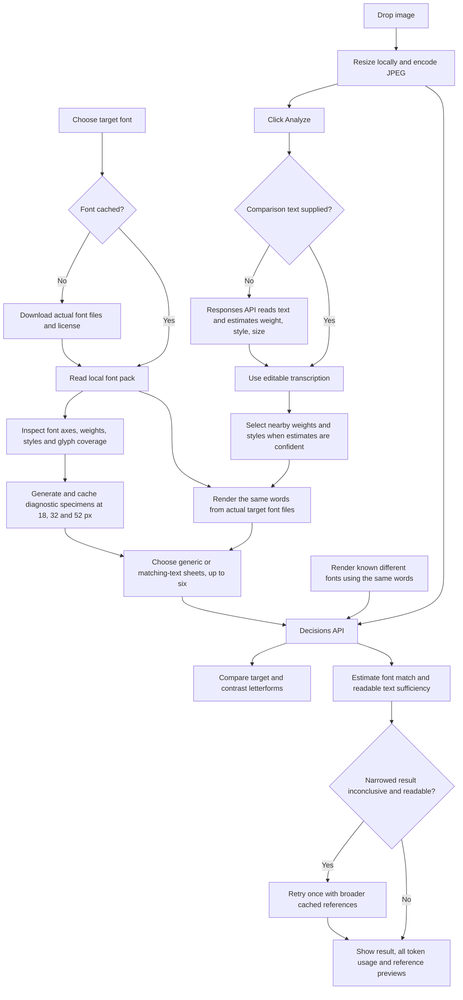

# Fonts Checker

Drop an image, choose a font, and compare its letterforms against references generated from the actual font files. A local prototype using OpenAI vision for text reading and the Decisions API for font-match estimates.



## What it does

- Downloads a selected Google Fonts family, preserving its license and recording source URLs and file hashes. Inter uses the bundled official Inter 4.1 files from [Rasmus Andersson](https://rsms.me/inter/).
- Generates clean reference sheets across available standard weights, upright/italic styles, sampled optical sizes, and **18, 32, and 52 px** text sizes.
- Reads a line from your image automatically, then renders the same text in the selected font for comparison. You can correct the transcription and analyze again.
- Includes comparison specimens from two other families (chosen from Inter, Roboto, and Open Sans) to challenge lookalike matches.
- Shows the estimated probability of a font match, a separate text-readability estimate, actual API token usage, and the reference images used.
- Caches font files and generated specimens locally so repeated checks reuse them. Committed diagnostic packs for Inter, Roboto, and Open Sans make initial preparation immediate on a fresh checkout.

## Workflow



## Run locally

Requires **Node.js 22+**, **Python 3.10+**, and an OpenAI API key with access to the Decisions API. Preparing a font without a committed pack needs internet access.

```sh
npm run setup:fonts
cp .env.example .env
```

Add your key as `OPENAI_API_KEY` in `.env`, then:

```sh
npm start
```

Open [localhost:3000](http://localhost:3000). Select a family such as Inter, Roboto, Open Sans, Montserrat, or Poppins. Font preparation begins after you stop typing. An unavailable family produces an error rather than silently using a substitute font. Proprietary families such as Arial and Helvetica cannot be downloaded through this provider.

PNG, JPEG, and WebP uploads up to 20 MB are resized locally to a selected maximum edge length of 768, 1,024, or 1,600 px. Uploads are sent to OpenAI only when you click **Analyze image**. Crop to the text for the best chance of a useful result.

## How the comparison works

Font files come from the official [Google Fonts repository](https://github.com/google/fonts), or bundled official Inter files. FontTools reads the font’s real weight and optical-size axes; Pillow renders specimens from instantiated font data. Static families use the styles actually present in their package. Variable weights are sampled at standard hundreds and axis endpoints; optical sizes use minimum, default, and a display sample where available. Other axes stay at defaults. This samples a family rather than enumerating every possible variation or OpenType feature.

The server generates all supported samples and sends at most six target-font sheets spanning the pack, plus two contrast sheets from different families, to keep requests bounded. Contrast sources are Inter, Roboto, and Open Sans, excluding the selected family. Each row includes multiple text sizes. The result reports whether all reference sheets were reused from cache. Long transcriptions are fitted by using a prefix at each size; missing glyphs cause an explicit error instead of rendering fallback characters. Font source details and exactly which variants were sent are included in the request and returned with the result.

The first image is always the **target**. Following images are explicitly marked **reference only**. The prompt asks the model to compare shared letterforms and ignore font names printed in the target. That instruction reduces label reliance but does not guarantee the model will ignore labels or distinguish close lookalikes.

Text extraction uses `gpt-4.1-mini` via the Responses API (`store: false`). Classification uses `gpt-6-luna` via `POST /v1/decisions`. OCR and classification are separately billed; token usage is shown separately. An OCR failure leaves manual transcription available. If no readable text is extracted, the checker can use generic diagnostic specimens.

## Adaptive reference selection

The same Responses request that reads text also estimates a broad weight class, upright/italic style, apparent size, and certainty. High-certainty estimates select neighboring weights (not a single weight), the likely style, and two nearby text sizes for small or display text. Medium certainty uses wider weight ranges and keeps both styles; low certainty retains full coverage. Optical-size samples remain broad because raster text size does not establish the font’s optical-size axis. Manual transcriptions are preserved while the image is profiled.

Filtered packs are cached by font, text, and selection. New filtered packs instantiate only the selected variants. Unavailable weight/style combinations fall back to full coverage. If a narrowed comparison returns 20–80% match probability with sufficient readable text, the server retries once with broader references. Both attempts and their total Decisions input tokens are reported. A failed broad retry leaves the first result visible with a notice. No retry runs for unreadable targets, already-broad comparisons, or confident results; confident mistakes remain possible.

This reduces reference volume when the profile is useful, but automatic retries can cost more than one full comparison. A live regular-upright Inter check sent six target variants in three reference images (including contrasts), using 3,967 input tokens versus 16,772 for the broad pass. It was inconclusive and retried, so total Decisions input was 20,739 tokens. This is one example, not a benchmark. Accuracy improvement has not been established; the evaluation below predates adaptive selection.

## Confidence and limitations

Results are **model estimates, not measured accuracy or glyph similarity scores**. A probability of at least 80% is shown as “likely,” at most 20% as “unlikely,” and the middle as “inconclusive.” A low readable-text estimate overrides the headline to indicate insufficient text. These thresholds are provisional and uncalibrated.

Reference generation supplies concrete comparison evidence; it does not train or permanently modify the model. Small text, blur, alternate glyphs, mixed typography, unsupported scripts, and similar fonts can still produce incorrect answers. An image cannot establish font provenance or licensing. More references do not guarantee better recognition.

The latest 44-case synthetic evaluation (9 October 2026) compared names-only decisions against matching-text target specimens plus contrast specimens. At the provisional thresholds, reference-assisted checking confidently identified **12 of 36 Inter cases**, rejected 3 Inter cases, correctly rejected 2 of 8 non-Inter cases, and incorrectly accepted 3 non-Inter cases. Twenty-four cases were inconclusive. The [saved evaluation summary](eval/latest-summary.json) records these counts. The names-only baseline identified 1 Inter case; 11 baseline questions were refused. These results show that references help some positives but **do not establish reliable discrimination of lookalikes**. The dataset is small, synthetic, uses shared text, and has few negative families. The hero screenshot is an example result, not an accuracy claim.

## Development and evaluation

```sh
npm test
```

Tests cover payload validation, safe font identifiers, reference path handling, generated Inter coverage, and separation of target and reference inputs. Set up the Python renderer before running tests.

`scripts/evaluate-font.mjs` compares names-only and generated-reference decisions on the included labeled fixtures:

```sh
node --env-file-if-exists=.env scripts/evaluate-font.mjs Inter
```

For Inter this makes 88 separately billed Decisions requests: 36 positive cases and eight negative cases, each tested with and without generated matching-text references. The same Inter fixtures can serve as negative cases for another target family, but add actual positive examples for that family before interpreting its results. Synthetic fixtures use text distinct from the diagnostic references. Add real screenshots and difficult lookalikes to broaden the test; keep comparison references separate from evaluation targets. Results are saved under ignored `eval/results/`.

## Storage and sources

- `.env` stays local and is excluded from Git. The server binds to localhost.
- `.cache/fonts/` stores downloaded fonts, licenses, source hashes, generated sheets, and transcribed text used to generate them. It is ignored by Git. Uploaded target images are not saved by the app. OpenAI’s data handling still applies to API requests.
- `.renderer/` contains the local Python environment and is ignored by Git. Dependencies are pinned in `scripts/requirements.txt`.
- Inter’s bundled font files retain the SIL Open Font License in `references/inter/LICENSE.txt`. Downloaded fonts retain their respective license files.

See [OpenAI Decisions](https://developers.openai.com/api/docs/guides/decisions), [OpenAI image input](https://developers.openai.com/api/docs/guides/images-vision), and [Google Fonts source files](https://github.com/google/fonts).

## Prebuilt packs and caching

`references/packs/` contains font files, licenses, provenance, and generic reference sheets for Inter, Roboto, and Open Sans. A fresh checkout seeds its local cache from these committed packs. Generic generation therefore does not run again for these families. Adding another selected font downloads and renders it once. Matching-text packs are cached by family, transcription, and reference selection; changing the words creates a new pack, while repeated words reuse the existing one. The first new transcription can take tens of seconds to render. Font files are pinned to the cached or committed version; upstream updates do not silently replace them.

To prepare and commit another generic family pack:

```sh
npm run prebuild:fonts -- Montserrat
git add references/packs/montserrat
```

The exporter copies only generic diagnostic references, fonts, licenses, and source metadata. It never exports cached user transcriptions. These remain under ignored `.cache/fonts/`. Regenerate packs deliberately when updating font files or the renderer.
